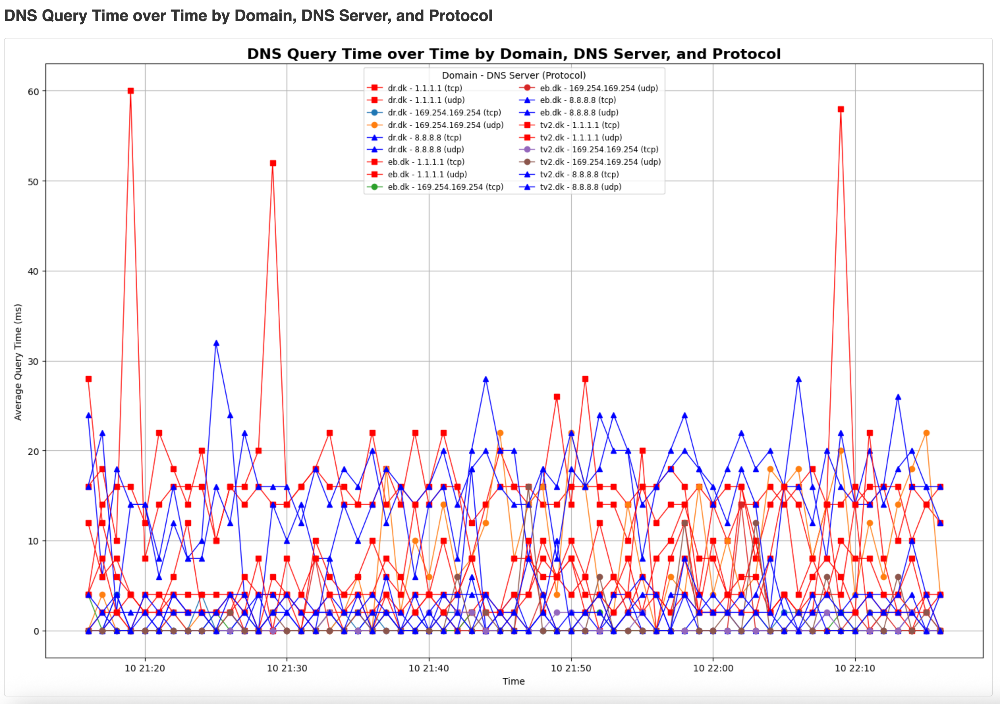

# DNS resolution latency report

A lightweight container with scripts to measure DNS resolution latency and generate an HTML page with the results.

## Build

```bash
podman build -t dnsplot .

```

## Run

### Measure DNS resolution latency

```bash
podman run --rm --entrypoint bash -v $PWD:/data dnsplot
# inside the container
/app/DNS-query-time.sh /data/dns_latency_log.csv

# one-liner
podman run --rm --entrypoint /bin/bash -v $PWD:/data dnsplot -c /app/dns_query_time.sh /data/dns_latency_log.csv

# run for 60 min
podman run --rm --entrypoint /bin/bash -v $PWD:/data dnsplot -c 'end=$((SECONDS+3600)); while [ $SECONDS -lt $end ]; do /app/dns_query_time.sh /data/dns_latency_log.csv; sleep 30; done'

```

### Generate the html page

```bash
podman run --rm -v $PWD:/data dnsplot /data/dns_latency_log.csv /data/dns_latency_log.html

```


